### Source Repo:

https://github.com/JunjiaWangUSF/devOpsSourceRepo

### Infrasturcue Repo:

https://github.com/JunjiaWangUSF/devOpsInfraRepo

### Runing Temp EC2 Workflow

https://github.com/JunjiaWangUSF/devOpsInfraRepo/blob/main/.github/workflows/launch-ec2.yml

### Nightly Build Workflow

https://github.com/JunjiaWangUSF/devOpsInfraRepo/blob/e9f426ae70741dce322f004f4d431c12d66f7104/README.

### Deploy RC Workflow

https://github.com/JunjiaWangUSF/devOpsInfraRepo/blob/e9f426ae70741dce322f004f4d431c12d66f7104/.github/workflows/promote.yml

### Create RC Workflow

https://github.com/JunjiaWangUSF/devOpsSourceRepo/blob/rc/.github/workflows/release.yml

### Prerequisites

- Node
- Docker
- AWS account
- Domain name
- Github account
- AWS CLI

### **Abstraction**

In the previous article, we explored how to set up a CI/CD pipeline to automate the creation of nightly builds and deploy our project to an EC2 instance. This article builds on that foundation, so ensure you are familiar with the necessary setup (e.g., CI/CD tools, AWS EC2, and basic deployment workflows) before proceeding. If you not familar with all content, please review previous article: https://github.com/JunjiaWangUSF/devOpsInfraRepo/blob/main/README.html

In this article, we will focus on the following key objectives:

1. **Semantic Versioning for Source Repositories**:

   - Implement semantic versioning (SemVer) to manage releases systematically.
   - Automate version tagging in the CI/CD pipeline to create release candidates (RCs) that are ready for deployment.
     More deatil: https://semver.org/

2. **Deep Dive into Nginx**:

   - Configure Nginx as a reverse proxy to serve our application.
   - Set up custom subdomains (e.g., `1-0-1.example.com`, `1-0-1-rc1.example.com`) to route traffic to different environments.

3. **Deployment to a New EC2 Instance**:
   - Provision a new EC2 instance for hosting the application.
   - Automate the deployment process using the CI/CD pipeline in Github to ensure seamless updates.

By the end of this article, you will have a robust workflow for managing releases, configuring Nginx for custom subdomains, and deploying your application to a new EC2 instance. This will help you achieve a more professional and scalable deployment process.

### **Source Repository**

In the source repository, we will focus on setting up **Semantic Versioning**, creating **release candidates**, and triggering a **dispatch workflow** to notify the infrastructure repository of new releases. Below is a step-by-step breakdown of the process:

#### **1. Semantic Versioning Setup**

- **Install Dependencies**:

```
npm install --save-dev semantic-release @semantic-release/git @semantic-release/changelog
```

- **Versioning Workflow**:

  - Use commit messages to determine the version bump:
    - `fix:` → Patch version (e.g., `v1.0.0` → `v1.0.1`).
    - `feat:` → Minor version (e.g., `v1.0.0` → `v1.1.0`).
    - Breaking changes → Major version (e.g., `v1.0.0` → `v2.0.0`).
  - Automatically generate release notes and tags using CI/CD tools (e.g., GitHub Actions, GitLab CI).

- Configure **.releaserc.json**:

```
{
  "branches": ["main", { "name": "rc", "channel": "rc", "prerelease": true }],
  "plugins": [
    "@semantic-release/commit-analyzer",
    "@semantic-release/release-notes-generator",
    [
      "@semantic-release/exec",
      {
        "prepareCmd": "echo 'RC_VERSION=rc${nextRelease.version}' >> .rc_version && git tag v${nextRelease.version}-rc",
        "publishCmd": "git push origin v${nextRelease.version}-rc"
      }
    ],
    [
      "@semantic-release/git",
      {
        "assets": [".rc_version"],
        "message": "chore(release): ${nextRelease.version} [skip ci]"
      }
    ],
    "@semantic-release/github"
  ],
  "repository": {
    "type": "git",
    "url": "https://github.com/JunjiaWangUSF/devOpsSourceRepo.git"
  }
}

```

- main: The primary branch for stable releases.

- rc: A branch for release candidates (pre-releases). Channel: "rc": Specifies that releases from this branch are pre-releases, rerelease: true: Marks releases from this branch as pre-releases (e.g., v1.0.0-rc.1). So any commit in rc branch will become a new release candiate.
  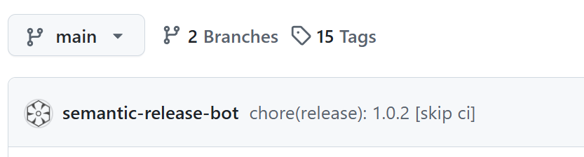
  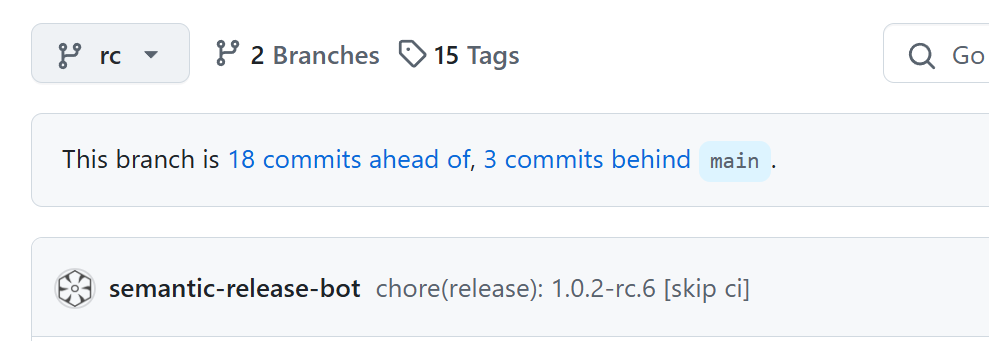

#### **2. Release Candidate Automation Workflow - Release.yml**

This GitHub Actions workflow automates the process of creating release candidates (RCs) for your project. It integrates with Semantic Release to manage versioning, generates a release candidate, and triggers a dispatch event to notify the infrastructure repository for further deployment steps.

```
name: Release
on:
  push:
    branches:
      - rc

jobs:
  release:
    runs-on: ubuntu-latest
    permissions:
      contents: write
      issues: write
      pull-requests: write
      repository-projects: write
      actions: write

    steps:
      - uses: actions/checkout@v4
        with:
          fetch-depth: 0

      - uses: actions/setup-node@v4
        with:
          node-version: 20

      - run: npm ci

      - name: Run Semantic Release
        env:
          GITHUB_TOKEN: ${{ secrets.GITHUB_TOKEN }}
        run: npx semantic-release

      - name: Set RC_VERSION
        run: |
          if [[ ! -f .rc_version ]]; then
            echo "❌ Error: .rc_version file not found"
            exit 1
          fi

          RC_VERSION=$(grep 'RC_VERSION=' .rc_version | tail -1 | awk -F= '{print $2}' | tr -d '[:space:]')

          if [[ ! "$RC_VERSION" =~ ^rc[0-9]+\.[0-9]+\.[0-9]+(-[a-z]+\.?[0-9]*)?$ ]]; then
            echo "❌ Invalid RC_VERSION format: $RC_VERSION"
            exit 1
          fi

          echo "Validated RC_VERSION: $RC_VERSION"
          echo "RC_VERSION=$RC_VERSION" >> $GITHUB_ENV

      - name: Trigger Infra Repo Dispatch
        env:
          INFRA_TOKEN: ${{ secrets.INFRA_REPO_TOKEN }}
        run: |
          sudo apt-get update && sudo apt-get install -y jq

          RC_VERSION=$(grep 'RC_VERSION=' .rc_version | tail -1 | awk -F= '{print $2}' | tr -d '[:space:]')

          JSON_PAYLOAD=$(jq -n \
            --arg event_type "promote-rc" \
            --arg rc_version "$RC_VERSION" \
            '{event_type: $event_type, client_payload: {rc_version: $rc_version}}')

          echo "Generated payload:"
          jq . <<< "$JSON_PAYLOAD"

          echo "Triggering dispatch event to devOpsInfraRepo..."

          curl -sS -X POST "https://api.github.com/repos/JunjiaWangUSF/devOpsInfraRepo/dispatches" \
            -H "Authorization: token $INFRA_TOKEN" \
            -H "Accept: application/vnd.github.v3+json" \
            -H "Content-Type: application/json" \
            -d "$JSON_PAYLOAD" \
            -w "\nHTTP Status: %{http_code}\n"
```

#### **Github Action Permission and PAT**

To ensure the GitHub Actions workflow has the necessary permissions to perform tasks like creating releases, pushing tags, and triggering repository dispatch events, you need to configure the following:

- Give your atcion read and write permission
  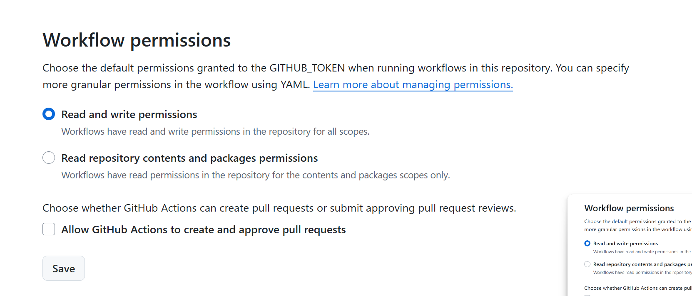

- Generate personal access token
  - Give action read and write access
  - Store token in Github secrets
    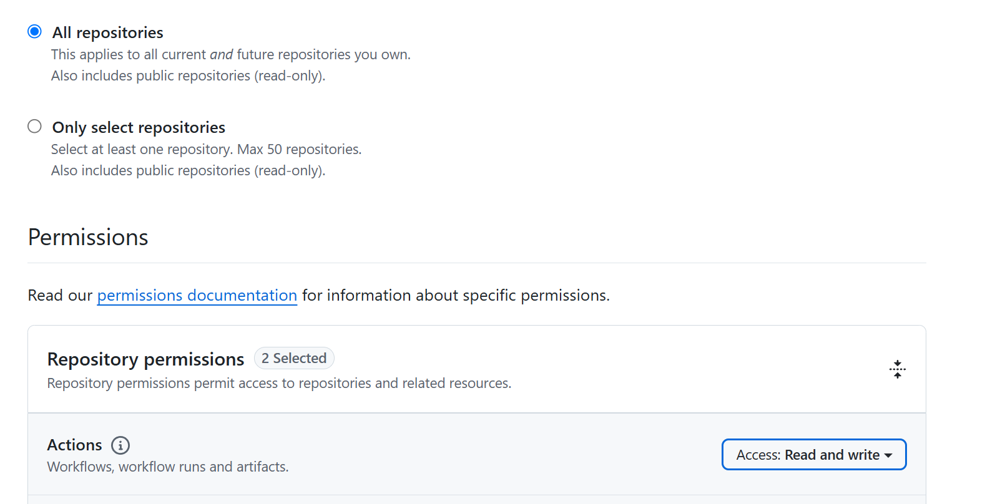

### **Assumptions**

- **Ideal Workflow**:
  - The release candidate image should be pushed to **Amazon Elastic Container Registry (ECR)**.
  - The infrastructure repository should handle retagging and deployment of the image.
- **Current Simplification**:
  - Since the source repository and infrastructure repository currently share the same content, the AWS-related code (e.g., ECR push) is placed in the infrastructure repository for simplicity.
  - To make this workflow functional, you can copy the AWS-related code (e.g., ECR push logic) from the infrastructure repository into this workflow.

---

#### **Why This Simplification?**

- **Testing and Development**:

  - This approach allows you to test the workflow end-to-end without separating the repositories.
  - Once the workflow is stable, you can refactor it to push images to ECR directly from the source repository.

- **Future Improvements**:
  - Move the AWS-related code (e.g., ECR push) to the source repository.
  - Use the infrastructure repository solely for deployment and retagging tasks.

---

#### **Example: Adding ECR Push to the Workflow**

Here’s an example of how you can add the ECR push logic to the workflow:

```yaml
jobs:
  release:
    runs-on: ubuntu-latest
    permissions:
      contents: write
      actions: write

    steps:
      - name: Checkout Code
        uses: actions/checkout@v4

      - name: Set Up AWS CLI
        uses: aws-actions/configure-aws-credentials@v4
        with:
          aws-access-key-id: ${{ secrets.AWS_ACCESS_KEY_ID }}
          aws-secret-access-key: ${{ secrets.AWS_SECRET_ACCESS_KEY }}
          aws-region: us-east-1

      - name: Login to Amazon ECR
        id: login-ecr
        uses: aws-actions/amazon-ecr-login@v2

      - name: Build, Tag, and Push Docker Image to ECR
        env:
          ECR_REGISTRY: ${{ steps.login-ecr.outputs.registry }}
          ECR_REPOSITORY: my-repo
          IMAGE_TAG: ${{ env.RC_VERSION }} # Use the release candidate version
        run: |
          docker build -t $ECR_REGISTRY/$ECR_REPOSITORY:$IMAGE_TAG .
          docker push $ECR_REGISTRY/$ECR_REPOSITORY:$IMAGE_TAG
```

### **Infrastructure Repository**

In this repository, we handle the deployment of release candidates using a **dispatch event** (`promote.yml`). This workflow receives the semantic version from the source repository, processes it, retags the latest images in ECR, sets up the custom domain and achieve automate deployment on our preset EC2 instance.

---

#### **Dispatch Event: `promote.yml`**

The `promote.yml` workflow is triggered by a repository dispatch event from the source repository. It performs the following tasks:

1. **Receive Semantic Version**:

   - The workflow receives the semantic version (e.g., `1.0.1-rc.1`) from the source repository.

2. **Parse Version**:

   - The version is parsed into a URL-friendly format (e.g., `1-0-1-rc-1`) for use in custom subdomains.

3. **Retag ECR Images**:

   - The latest images from the **frontend** and **backend** ECR repositories are retagged with the semantic version.
   - Example: - Original tag: `latest` - New tag: `1-0-1-rc.1`

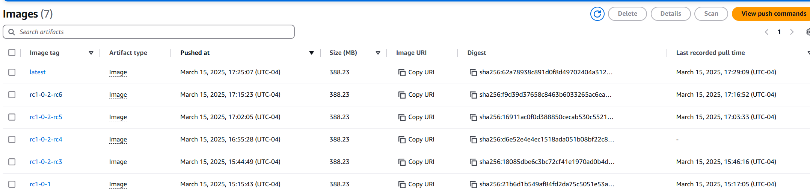

4. **Deploy to EC2 with Nginx**:
   - The retagged images are deployed to an EC2 instance, run docker images and subsitute server name with our subdomain in Nginx configuraruib file. Will have more deatils on EC2 set up section.
   - Nginx is set up to handle the custom subdomain (e.g., `1-0-1-rc-1.domain.com`)

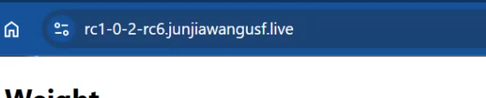

Workflow Details:

```
name: Promote RC
on:
  repository_dispatch:
    types: [promote-rc]

jobs:
  promote:
    runs-on: ubuntu-latest
    environment: production
    concurrency:
      group: rc-deployment
      cancel-in-progress: true

    steps:
      - name: Extract RC Version
        run: |
          echo "RC_VERSION=${{ github.event.client_payload.rc_version }}" >> $GITHUB_ENV
          echo "TARGET_TAG=${RC_VERSION#rc}" >> $GITHUB_ENV

      - name: Extract and Sanitize RC Version
        run: |
          # Convert rc1.0.2-rc.1 to rc1-0-2-rc-1
          SANITIZED_VERSION=$(echo "${{ github.event.client_payload.rc_version }}" | tr '.' '-' | sed 's/rc-/rc/g')
          echo "RC_VERSION=$SANITIZED_VERSION" >> $GITHUB_ENV
          echo "SUBDOMAIN=${SANITIZED_VERSION}.junjiawangusf.live" >> $GITHUB_ENV
          echo  SUBDOMAIN

      - name: Checkout code
        uses: actions/checkout@v4

      - name: Set up Docker Buildx
        uses: docker/setup-buildx-action@v2

      - name: Install Docker Compose
        run: |
          sudo curl -L "https://github.com/docker/compose/releases/download/v2.23.0/docker-compose-$(uname -s)-$(uname -m)" -o /usr/local/bin/docker-compose
          sudo chmod +x /usr/local/bin/docker-compose
          docker-compose --version

      - name: Configure AWS credentials
        uses: aws-actions/configure-aws-credentials@v3
        with:
          aws-access-key-id: ${{ secrets.AWS_ACCESS_KEY_ID }}
          aws-secret-access-key: ${{ secrets.AWS_SECRET_ACCESS_KEY }}
          aws-session-token: ${{ secrets.AWS_SESSION_TOKEN }}
          aws-region: ${{ secrets.AWS_REGION }}

      - name: Log in to Amazon ECR
        run: |
          aws ecr get-login-password --region ${{ secrets.AWS_REGION }} | docker login --username AWS --password-stdin ${{ secrets.AWS_ACCOUNT_ID }}.dkr.ecr.${{ secrets.AWS_REGION }}.amazonaws.com

      - name: Build and push backend image
        env:
          ECR_REGISTRY: ${{ secrets.AWS_ACCOUNT_ID }}.dkr.ecr.${{ secrets.AWS_REGION }}.amazonaws.com
          ECR_REPOSITORY: backend
        run: |
          cd backend
          docker build -t $ECR_REGISTRY/$ECR_REPOSITORY:${{ env.RC_VERSION }} .
          docker push $ECR_REGISTRY/$ECR_REPOSITORY:${{ env.RC_VERSION }}

      - name: Build and push frontend image
        env:
          ECR_REGISTRY: ${{ secrets.AWS_ACCOUNT_ID }}.dkr.ecr.${{ secrets.AWS_REGION }}.amazonaws.com
          ECR_REPOSITORY: frontend
        run: |
          cd frontend
          docker build -t $ECR_REGISTRY/$ECR_REPOSITORY:${{ env.RC_VERSION }} .
          docker push $ECR_REGISTRY/$ECR_REPOSITORY:${{ env.RC_VERSION }}

      - name: Use private key
        run: |
          chmod 400 keys/2_26_2025.pem

      - name: Deploy to EC2
        run: |
          ssh -o StrictHostKeyChecking=no -i keys/2_26_2025.pem ubuntu@ec2-54-88-57-107.compute-1.amazonaws.com << EOSSH
          # Cleanup previous deployment
          docker rm -f frontend-${{ env.RC_VERSION }} backend-${{ env.RC_VERSION }} 2>/dev/null || true
          docker network rm rc-${{ env.RC_VERSION }} 2>/dev/null || true

          # Login to ECR
          aws ecr get-login-password --region ${{ secrets.AWS_REGION }} | \
            docker login --username AWS --password-stdin ${{ secrets.AWS_ACCOUNT_ID }}.dkr.ecr.${{ secrets.AWS_REGION }}.amazonaws.com

          # Pull images with sanitized tag
          docker pull ${{ secrets.AWS_ACCOUNT_ID }}.dkr.ecr.${{ secrets.AWS_REGION }}.amazonaws.com/backend:${{ env.RC_VERSION }}
          docker pull ${{ secrets.AWS_ACCOUNT_ID }}.dkr.ecr.${{ secrets.AWS_REGION }}.amazonaws.com/frontend:${{ env.RC_VERSION }}

          # Create network
          docker network create rc-${{ env.RC_VERSION }}

          # Start containers
          docker run -d \
           --name backend-${{ env.RC_VERSION }} \
           --network rc-${{ env.RC_VERSION }} \
           -p 8000:8000 \
           -e DB_HOST="database-1.cmkrqsxfvwur.us-east-1.rds.amazonaws.com" \
           -e DB_USER="admin" \
           -e DB_PASSWORD="password" \
           -e DB_DATABASE="weightTracker" \
           -e PORT=8000 \
           ${{ secrets.AWS_ACCOUNT_ID }}.dkr.ecr.${{ secrets.AWS_REGION }}.amazonaws.com/backend:${{ env.RC_VERSION }}

          docker run -d \
            --name frontend-${{ env.RC_VERSION }} \
            --network rc-${{ env.RC_VERSION }} \
            -p 8080:3000 \
            ${{ secrets.AWS_ACCOUNT_ID }}.dkr.ecr.${{ secrets.AWS_REGION }}.amazonaws.com/frontend:${{ env.RC_VERSION }}

          # Nginx configuration
          sudo bash -c "sed -e 's/{{SUBDOMAIN}}/${{ env.SUBDOMAIN }}/g' \
                            /etc/nginx/templates/rc-template.conf > \
                            /etc/nginx/sites-available/${{ env.SUBDOMAIN }}.conf"

          sudo ln -sf /etc/nginx/sites-available/${{ env.SUBDOMAIN }}.conf \
                    /etc/nginx/sites-enabled/

          sudo systemctl daemon-reload
          sudo nginx -t && sudo systemctl restart nginx
          EOSSH
        env:
          AWS_ACCOUNT_ID: ${{ secrets.AWS_ACCOUNT_ID }}
          AWS_REGION: ${{ secrets.AWS_REGION }}
```

### **EC2 setup**

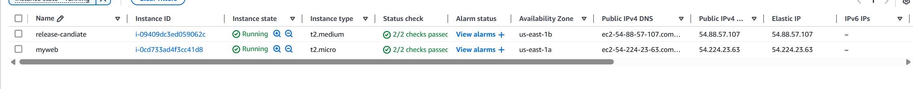

- Create Ubuntu EC2 instance
- Install AWS Cli, Docker, Python, Ngnix and Certbot

```
 sudo apt-get update
sudo apt-get install -y ca-certificates curl
sudo install -m 0755 -d /etc/apt/keyrings

sudo curl -fsSL https://download.docker.com/linux/ubuntu/gpg -o /etc/apt/keyrings/docker.asc

sudo chmod a+r /etc/apt/keyrings/docker.asc
"deb [arch=$(dpkg --print-architecture) signed-by=/etc/apt/keyrings/docker.asc] https://download.docker.com/linux/ubuntu \
$(. /etc/os-release && echo "${UBUNTU_CODENAME:-$VERSION_CODENAME}") stable"

sudo tee /etc/apt/sources.list.d/docker.list > /dev/null
sudo apt-get update
sudo apt-get install -y docker-ce docker-ce-cli containerd.io docker-buildx-plugin docker-compose-plugin
sudo curl -L "https://github.com/docker/compose/releases/latest/download/docker-compose-$(uname -s)-$(uname -m)" -o /usr/local/bin/docker-compose
sudo chmod +x /usr/local/bin/docker-compose
sudo systemctl enable docker
sudo systemctl start docker

# Add ubuntu user to docker group
sudo usermod -aG docker ubuntu

# Install Python and AWS CLI
sudo apt install -y python3
sudo apt install -y python3-pip
sudo pip install awscli --break-system-packages
# Ensure .aws directory exists
mkdir -p ~/.aws

sudo vim crenitals

# copy access key/secrets/session tokens

sudo apt install -y nginx certbot python3-certbot-nginx

# Verify installation
nginx -v          # Should show version (e.g., nginx/1.18.0)
certbot --version # Should show certbot version

```

### **Certbot DNS-01 Challenge**

```
sudo certbot certonly --manual --preferred-challenges=dns \
  -d *.junjiawangusf.live \
  --email your-email@example.com \
  --agree-tos \
  --manual-public-ip-logging-ok \
  --non-interactive

```

The **DNS-01 Challenge** is a method used by **Certbot** (a tool from Let's Encrypt) to verify domain ownership and issue SSL certificates. Unlike the HTTP-01 challenge, which requires serving files over HTTP, the DNS-01 challenge uses DNS records for verification. This makes it ideal for:

- **Wildcard Domains**: Issuing certificates for `*.example.com`.
- **Custom Subdomains**: Issuing certificates for dynamically generated subdomains (e.g., `app-1-0-1-rc-1.example.com`).
- **Non-HTTP Services**: Certifying domains that don't serve HTTP traffic.

---

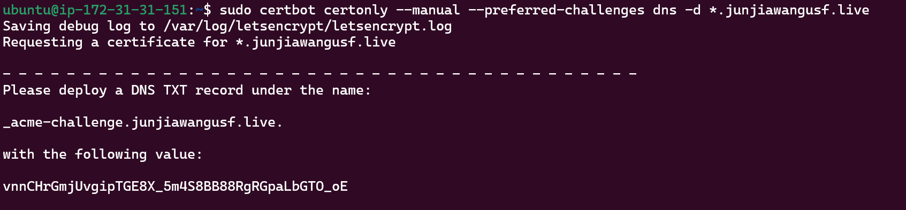

#### **How DNS-01 Challenge Works**

1. **Certbot Requests a Challenge**:

   - Certbot asks Let's Encrypt for a DNS-01 challenge token.

2. **Create a DNS TXT Record**:

   - You create a DNS TXT record with the challenge token under `_acme-challenge.<your-domain>`.

3. **Let's Encrypt Verifies the Record**:

   - Let's Encrypt queries the DNS record to verify domain ownership.

4. **Certificate Issued**:
   - Once verified, Let's Encrypt issues the SSL certificate.

#### **Route53 Record Update**

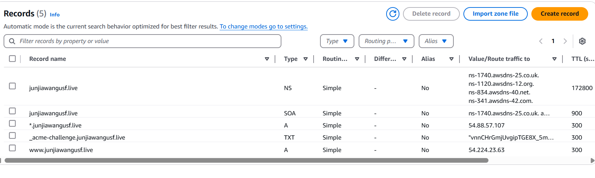

1. Update A record that wildcard domain can point to our new create EC2 instance.

2. Update DNS TXT Record
   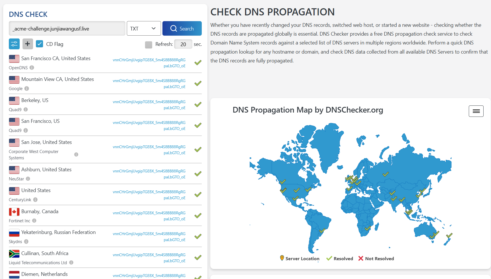

#### **SSL Certificate**

After text records are updated in DNS, processed the process

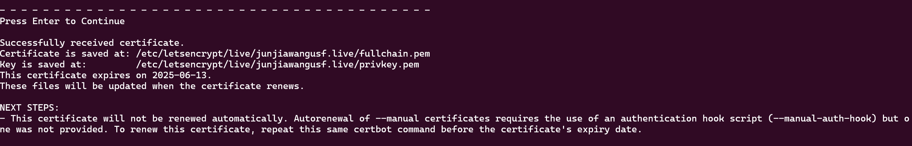

#### **Nginx Setup**

Setting up a new site configuration in Nginx by using a template file, replacing placeholders with specific values, and linking the configuration into the active directory, thus enabling the site without manually editing configuration files.

| Directory                   | Purpose                                          |
| --------------------------- | ------------------------------------------------ |
| /etc/nginx/templates/       | Stores reusable configuration templates          |
| /etc/nginx/sites-available/ | Stores individual site configurations            |
| /etc/nginx/sites-enabled/   | Contains symbolic links to active configurations |

```
sudo /etc/nginx/templates/rc-template.conf
```

Copy following content

```
# Redirect HTTP to HTTPS
server {
    listen 80;
    server_name {{SUBDOMAIN}};    return 301 https://$host$request_uri;
}

# HTTPS Server
server {
    listen 443 ssl;
    server_name {{SUBDOMAIN}};

    ssl_certificate /etc/letsencrypt/live/junjiawangusf.live/fullchain.pem;  # SSL certificate
    ssl_certificate_key /etc/letsencrypt/live/junjiawangusf.live/privkey.pem;  # SSL certificate private key
    ssl_protocols TLSv1.2 TLSv1.3;  # Recommended TLS versions
    ssl_ciphers 'ECDHE-ECDSA-AES256-GCM-SHA384:ECDHE-RSA-AES256-GCM-SHA384:ECDHE-ECDSA-CHACHA20-POLY1305:ECDHE-RSA-CHACHA20-POLY1305:ECDHE-ECDSA-AES128-GCM-SHA256:ECDHE-RSA-AES128-GCM-SHA256';
    ssl_prefer_server_ciphers on;

    # Serve frontend
    location / {
        proxy_pass http://localhost:8080;  # Forward requests to your frontend on port 8080
        proxy_set_header Host $host;
        proxy_set_header X-Real-IP $remote_addr;
        proxy_set_header X-Forwarded-For $proxy_add_x_forwarded_for;
        proxy_set_header X-Forwarded-Proto $scheme;
    }

    # Serve backend API
    location /api/ {
        proxy_pass http://localhost:8000/;  # Forward requests to your backend on port 8000
        proxy_set_header Host $host;
        proxy_set_header X-Real-IP $remote_addr;
        proxy_set_header X-Forwarded-For $proxy_add_x_forwarded_for;
        proxy_set_header X-Forwarded-Proto $scheme;
    }
}
```

- Following is the key part in workflow

```
 # Nginx configuration
          sudo bash -c "sed -e 's/{{SUBDOMAIN}}/${{ env.SUBDOMAIN }}/g' \
                            /etc/nginx/templates/rc-template.conf > \
                            /etc/nginx/sites-available/${{ env.SUBDOMAIN }}.conf"

          sudo ln -sf /etc/nginx/sites-available/${{ env.SUBDOMAIN }}.conf \
                    /etc/nginx/sites-enabled/
```

### **Visit Our Website**

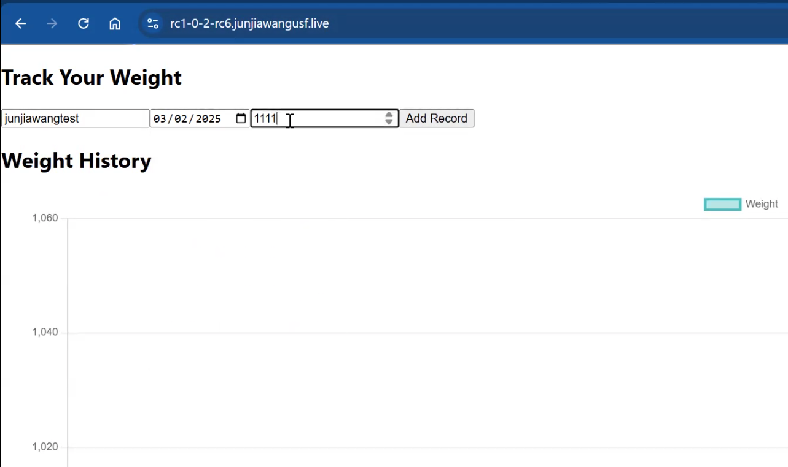

### **Challenges**

1. DNS-01 test
2. Nginx to hold subdomain
3. Understand Semantic version and release candiate tag.
